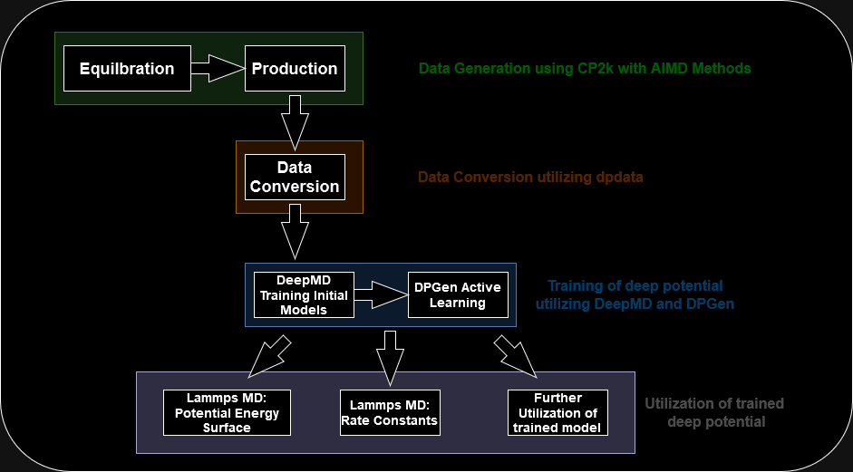

# Deepflow

Deepflow is a workflow package designed to automate the generation of ab initio molecular dynamics data using CP2K. The generated data ist then used to train deep potentials using the DPGen active learning procedure. The workflow utilizes the programs CP2k, deepmd, dpgen, dpdata and lammps.

## Installation

### Requirements:

CP2k

plumed

DeepMD with lammps conda version:     
            
            https://github.com/deepmodeling/deepmd-kit/releases

miniconda:  
            
            wget https://repo.anaconda.com/miniconda/Miniconda3-latest-Linux-x86_64.sh
            bash Miniconda3-latest-Linux-x86_64.sh

### Install
After downloading the repository first the settings should be adjusted. 

            deepflow/input_files/update_input.json

This json files updates the remaining input files in their respective folders.
If the submission methods differs they can be adjusted manually as well.

            deepflow/input_files/workflow_step

After setting up the 'update_input.json' the program can be installed with:

            pip install .

## Deepflow commands

Before usage make you sure to export the path of the installation directory:

            export PATH="$HOME/.local/bin:$PATH"

Execute the program with:

            deepflow -h

To create a new project, use the following command:

            deepflow new path/to/project path/to/xyz_or_pdb_file
          
Before running the program the project_path/input_files/update_input.json should be updated with the correct lattice parameters.
Deepflow can be run with:

            deepflow run path/to/project

The 'run' commands executes the following functions in a workflow routine. 

            Cp2kEquilibration.setup()
            Cp2kEquilibration.run()
            Cp2kProduction.setup()
            Cp2kProduction.run()
            DpGenDataConversion.setup()
            DpGenDataConversion.run()
            DeepMDTrainModel.setup()
            DeepMDTrainModel.setup()
            DpGenActiveLearning.setup()
            
            

To have better control over each workflow step the project can be loaded into a Python environment.

            deepflow load path/to/project

The following commands are available after loading a project:

            equil           : Cp2kEquilibration
                    - setup()   : Set up the equilibration step
                    - run()     : Execute the equilibration step
                    - clear()   : Clear the equilibration step data

            prod            : Cp2kProduction
                    - setup()   : Set up the production MD step
                    - run()     : Execute the production MD step
                    - clear()   : Clear the production MD step data

            dataconv        : DpGenDataConversion
                    - setup()   : Set up the data conversion step
                    - run()     : Execute the data conversion step
                    - clear()   : Clear the data conversion step data

            activelearning  : DpGenActiveLearning
                    - setup()   : Set up the active learning step
                    - run()     : Starts the active learning step
                    - clear()   : Clear the active learning step data

            lammps          : LammpsTestRun
                    - setup(model_iter : int,steps=10000000,temperature=310)   : Set up the LAMMPS molecular dynamics run with the deep potential of the active learning iteration number: model_iter
                    - run()     : Execute the LAMMPS  run step
                    - clear()   : Clear the LAMMPS test run step data

            rateconstants   : LammpsCalculateRateConstants

                    - generate_start(model_iter: int): Generates different independent restarts files with a deep potential model from the active learning procedure. Needs to be run before run_rates() function.
                    - run_rates(model_iter: int, number_parallel_md=1)     : Execute the rate constants calculation step with a deep potential from a active learning iteration.
                    - restart_rates(model_iter: int, number_folder=0): Restarts Molecular dynamics run from the run_rates() function which were not converged yet
                    - calc_rates(): calculates the rate constant from the run_rates() function. 

            train           : DeepMDTrainModel
                    - setup()   : Set up the DeepMD training step
                    - run()     : Execute the DeepMD training step
                    - clear()   : Clear the DeepMD training step data

            util            : UtilizationTools
                    - avg_bond_length() : Calculate the average bond length
                    - plot()            : Plot COLVAR file, max_devi_force and average_bond_length of each active learning iteration.

            fes           : FreeEnergySurface
                    - run()     : Runs a reweghting script to obtain the FES from the LammpsTestRun COLVAR file.
                    - plot()   : Plots the FES aswell as the convergence of the FES.

Example command in the Python environment:

            equil.setup()
