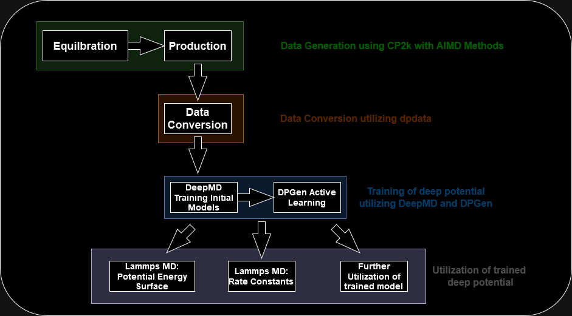

# Deepflow

Deepflow is a workflow package designed to automate the generation of ab initio molecular dynamics data using CP2K, along with training deep potentials using the DPGen active learning procedure. Additionally, it supports utilizing LAMMPS for potential energy surface acquisition and rate constant calculations.

## Installation

### Requirements:

CP2k:       included in the module system of the RWTH Cluster

plumed:     included in the CP2k installation

DeepMD with lammps:     
            
            https://github.com/deepmodeling/deepmd-kit/releases

miniconda:  
            
            wget https://repo.anaconda.com/miniconda/Miniconda3-latest-Linux-x86_64.sh
            bash Miniconda3-latest-Linux-x86_64.sh

### Install

            git clone https://github.com/mttbmann/Deepflow.git
            cd Deepflow
            ml Python
            pip install .

## Deepflow commands

Before usage make you export the path of the installation directory:

            export PATH="$HOME/.local/bin:$PATH"

Execute the program with:

            deepflow -h

To create a new project, use the following command:

            deepflow new path/to/project path/to/xyz_or_pdb_file

After creating a project the general settings should be adjusted in:

            project_path/input_files/update_input.json:

To adjust the settings for each workflow step the input files adjusted: 

            project_path/input_files/workflow_step
          
After adjusting the settings a project can be run with:

            deepflow run path/to/project

The 'run' commands executes the following functions in a workflow routine. 

            Cp2kEquilibration.setup()
            Cp2kEquilibration.run()
            Cp2kProduction.setup()
            Cp2kProduction.run()
            DpGenDataConversion.setup()
            DpGenDataConversion.run()
            DeepMDTrainModel.setup()
            DeepMDTrainModel.setup()
            DpGenActiveLearning.setup()
            
            

Or the project can be loaded into a Python environment.

            deepflow load path/to/project

Available Commands After Loading a Project:

            equil           : Cp2kEquilibration
                    - setup()   : Set up the equilibration step
                    - run()     : Execute the equilibration step
                    - clear()   : Clear the equilibration step data

            prod            : Cp2kProduction
                    - setup()   : Set up the production MD step
                    - run()     : Execute the production MD step
                    - clear()   : Clear the production MD step data

            dataconv        : DpGenDataConversion
                    - setup()   : Set up the data conversion step
                    - run()     : Execute the data conversion step
                    - clear()   : Clear the data conversion step data

            activelearning  : DpGenActiveLearning
                    - setup()   : Set up the active learning step
                    - run()     : Execute the active learning step
                    - clear()   : Clear the active learning step data

            lammps          : LammpsTestRun
                    - setup()   : Set up the LAMMPS test run step with the deep potential of the latest active learning iteration.
                    - run()     : Execute the LAMMPS test run step
                    - clear()   : Clear the LAMMPS test run step data

            rateconstants   : LammpsCalculateRateConstants
                    - setup()   : Set up the rate constants calculation step
                    - run()     : Execute the rate constants calculation step
                    - clear()   : Clear the rate constants calculation step data

            train           : DeepMDTrainModel
                    - setup()   : Set up the DeepMD training step
                    - run()     : Execute the DeepMD training step
                    - clear()   : Clear the DeepMD training step data

            util            : UtilizationTools
                    - avg_bond_length() : Calculate the average bond length
                    - plot()            : Plot COLVAR file, max_devi_force and average_bond_length of each active learning iteration.

Example command in the Python environment:

            equil.setup()
